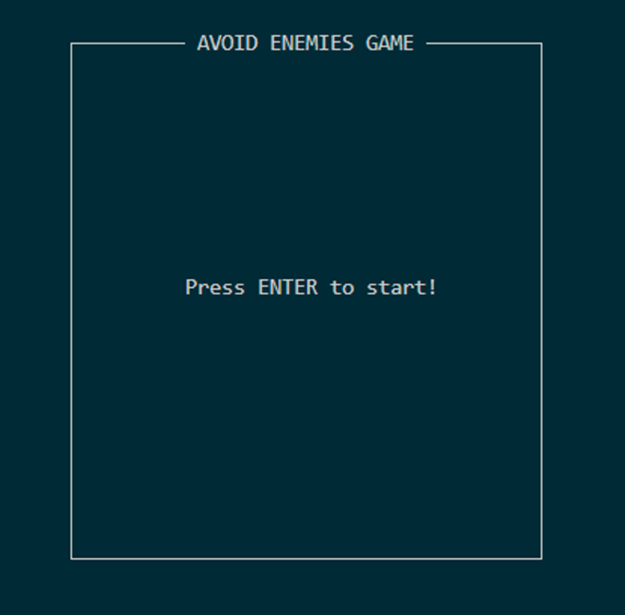
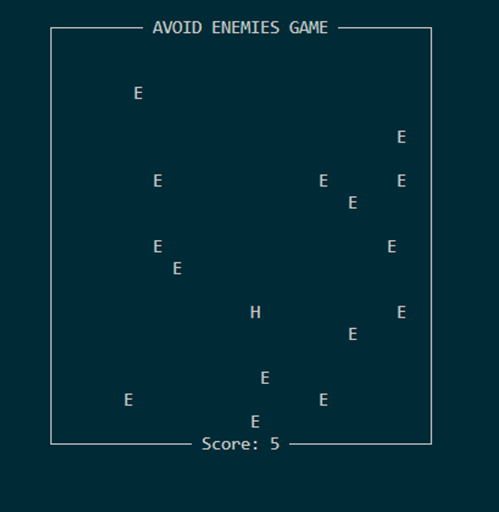
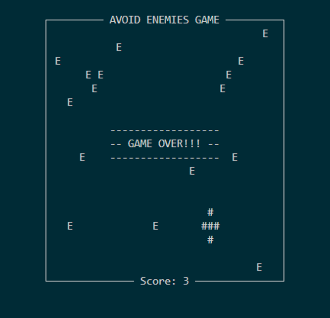
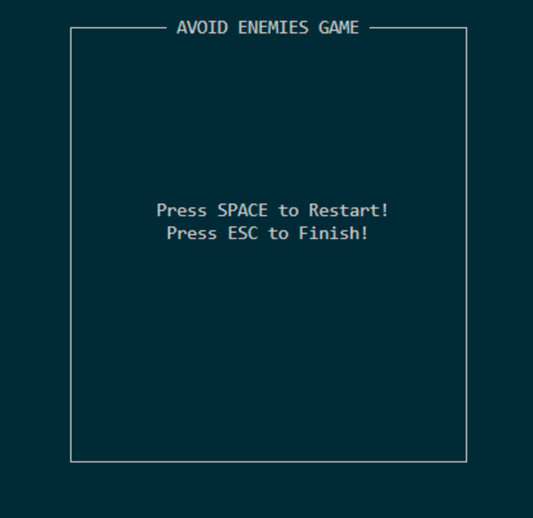

# Avoid-Monsters-Game
The simple game written in C/C++ based on ncurses and pthread library. You can move the hero using WSAD buttons. If you collide with eny enemy the game is finsh and the scores couter is stopped. One point is equal to spend one second at the board without collision. After lose you can restart game or close it. Have fun :smiley:

## Screenshots

||  |
| :--: | :--: |
| *Starting screen* | *Gameplay* |

| |  |
| :--: | :--: |
| *Game over* | *Message after lose* |
